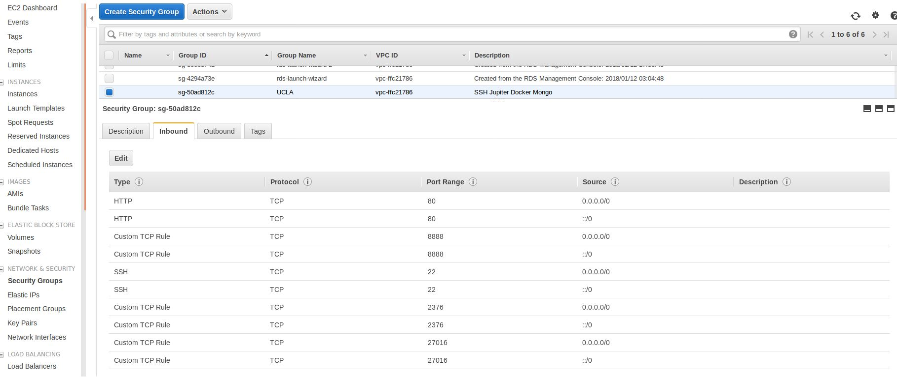

# Project 1: The Data Science Toolkit

The goal of this first project is to set up a jupyter notebook.  
A jupyter notebook is a web application where you can run `python` / `r` code but also save notebooks for later.  
The notebook is going to be running in a docker container hosted on an EC2 instance.  

## Table of Contents
1. [Create ssh keys](#part1)
2. [Create an EC2 instance](#part2)
3. [Install Docker on you EC2 instance](#part3)
4. [Install Jupiter to run on Docker](#part4)
5. [Launch Jupyter](#part5)
6. [Access you Jupiter notebook from a browser](#part6)

## Create ssh keys 

In order to connect to the EC2 instance we will be building at step 2 we first need to create a pair of private / public ssh keys which we will load into the list of autorized autorized keys on the EC2 instance

In your laptop terminal : `ssh-keygen`  
You don't need to provide a file to add it and a password

## Create an EC2 instance 

Go to [Amazon AWS](https://aws.amazon.com/) and create an account

1. Go to [EC2](5https://us-west-2.console.aws.amazon.com/ec2/v2/home?region=us-west-2)
2. Configure security groups:
    + Open ports 22 (SSH) 80, 8888, 
    + The group should look like this screenshot : 
3. Configure your instance:
    + Choose Ubuntu 
    + Choose t2;micro
    + The rest of the configuration is straight forward untill you launch the instance
    + Add you ssh public key : 
        + In your terminal : 
        `cd ./ssh`  and `cat id_rsa.pub`  
        + copy the output
4. Launch and retrieve to public ip adress

    
        

## Install Docker on you EC2 instance 

Connect to your EC2 instance : `ssh ubuntu@myEC2instanceIP`

The prompt should now like this : `ubuntu@ip-172-31-17-108:~$`

Install using : `curl -sSL https://get.docker.com | sh`

## Install Jupiter to run on Docker 
As said in the introduction, we are not running Jupyter from our EC2 instance but from a Docker container hosted on our EC2 instance. This is going to make Jupyter's installation much easier :  
We just need to pull Jupyter's docker image : `docker pull jupyter/datascience-notebook`

## Launch Jupyter 
Check that you have correctly pulled the jupyter image : `docker images`  
Then run : `docker run -v /home/ubuntu:/home/jovyan -p80:8888 -d jupyter/datascience-notebook`

## Access you Jupiter notebook from a browser 
Open you browser and go to `ipAdressOfYourEC2Instance:80`  
You will be asked a token / password which you can find by running :  
`docker ps` to list all docker process running : find yours and copy it's id  
Then run : `docker exec IdOfYourProcess jupyter notebook list

## How much does it cost ?

The price of the EC2 instance depends its configuration which includes :

 * The type of machine : general, compute oriented, GPU, memory oriented
 * Number of vCPU - This indicates your ability to split your computation into pieces running simultaneously (paralel computing)
 * Memory size : the size of data you can perform computation on
 * Storage size
You pay based on the time your instance is up - you can shut it down when you don't use it and will not be paying for this time.

|Type | vCPU | Memory | Price per Hour (\$)| Price per Month (\$)|
|----|----|------|--------------|----------------|
|general | 1 | 2 | 0.023 | 6.6 |
|general | 8 | 32 | 0.4 | 115 |
|compute oriented | 4 | 61 | 0.9 | 259 |
|compute oriented | 32 | 488 | 7.8 | 2074 |

